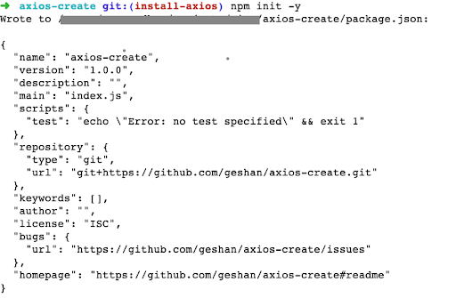
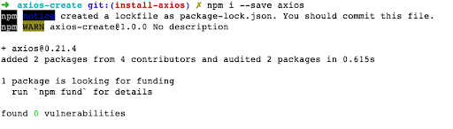
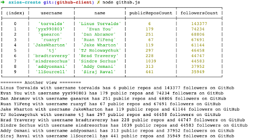

# axios-create-call-github-api

# 🚀 Use Axios.create to call the GitHub API 🚀

https://github.com/coding-to-music/axios-create-call-github-api

From / By https://blog.logrocket.com/understanding-axios-create/

## Environment variables:

```java

```

## GitHub

```java
git init
git add .
git remote remove origin
git commit -m "first commit"
git branch -M main
git remote add origin git@github.com:coding-to-music/axios-create-call-github-api.git
git push -u origin main
```

# Understanding Axios.Create

https://blog.logrocket.com/understanding-axios-create/

By Geshan Manandhar

Geshan is a seasoned software engineer with more than a decade of software engineering experience. He has a keen interest in REST architecture, microservices, and cloud computing. He also blogs at geshan.com.np.
Understanding Axios.create

October 6, 2021 6 min read

```
> axios-create-call-github-api@1.0.0 start
> node index.js

┌─────────┬────────────────────┬─────────────────────┬──────────────────┬────────────────┐
│ (index) │      username      │        name         │ publicReposCount │ followersCount │
├─────────┼────────────────────┼─────────────────────┼──────────────────┼────────────────┤
│    0    │     'torvalds'     │  'Linus Torvalds'   │        7         │     167710     │
│    1    │    'yyx990803'     │     'Evan You'      │       180        │     86639      │
│    2    │     'gaearon'      │        'dan'        │       262        │     77901      │
│    3    │      'ruanyf'      │    'Ruan YiFeng'    │        67        │     72885      │
│    4    │   'JakeWharton'    │   'Jake Wharton'    │       125        │     63849      │
│    5    │   'peng-zhihui'    │       '稚晖'        │        53        │     61593      │
│    6    │   'bradtraversy'   │   'Brad Traversy'   │       251        │     58634      │
│    7    │ 'gustavoguanabara' │ 'Gustavo Guanabara' │        5         │     52918      │
│    8    │   'sindresorhus'   │   'Sindre Sorhus'   │       1060       │     51834      │
│    9    │        'tj'        │  'TJ Holowaychuk'   │       296        │     48717      │
└─────────┴────────────────────┴─────────────────────┴──────────────────┴────────────────┘
======== Another view ========
Linus Torvalds with username torvalds has 7 public repos and 167710 followers on GitHub
Evan You with username yyx990803 has 180 public repos and 86639 followers on GitHub
dan with username gaearon has 262 public repos and 77901 followers on GitHub
Ruan YiFeng with username ruanyf has 67 public repos and 72885 followers on GitHub
Jake Wharton with username JakeWharton has 125 public repos and 63849 followers on GitHub
稚晖 with username peng-zhihui has 53 public repos and 61593 followers on GitHub
Brad Traversy with username bradtraversy has 251 public repos and 58634 followers on GitHub
Gustavo Guanabara with username gustavoguanabara has 5 public repos and 52918 followers on GitHub
Sindre Sorhus with username sindresorhus has 1060 public repos and 51834 followers on GitHub
TJ Holowaychuk with username tj has 296 public repos and 48717 followers on GitHub
```

With more than 19.5 million weekly downloads, Axios is one of the most popular Javascript libraries one can use to make HTTP requests. It can be used in both the browser and with Node.js, which heightens its popularity.

With support for Promises and great features like request-response, transform, and interceptors, Axios is a great choice for making HTTP calls.

Axios.create is a handy feature within Axios used to create a new instance with a custom configuration. With Axios.create, we can generate a client for any API and reuse the configuration for any calls using the same client, as we will see in the example below.

In this post, we will learn how to use Axios.create with GitHub API examples so you can follow along.

## Introduction

Axios is a simple Promise-based HTTP client for the browser and Node. It provides an easy-to-use library with a small footprint. It also has an extensible interface and great features like automatic transforms for JSON data, and client-side support for protecting against XSRF, to mention a few.

For the server side (Node), it relies upon the native Node.js HTTP module, whereas on the client side (the browser), it uses XMLHttpRequests. Being isomorphic, Axios is one of the few libraries that can be used without a sweat on both the browser and server side.

If we perform a regular require of Axios, we will receive the default instance. Let’s say we want to add a custom config, like a timeout of one second, that is not easily possible with const axios = require('axios')?

This is where Axios.create shines as compared to the usual “require” of Axios, even though both return an instance of Axios. With Axios.create, we can set up a config like baseUrl, and all of the calls made will simply require the URI for the HTTP calls, without the full URL.

### Prerequisites

Before we dive into the code, make sure you have the following in order to follow along with this tutorial:

- Working knowledge of JavaScript
- Node.js (preferably the latest LTS version) installed on your machine, or you can try out the example of JSfiddle
- Working knowledge of npm functions
  I will be using a Unix-like system for this guide.

Next up, we will look at how to install Axios on a demo Node application.

## How to install Axios

If you want to run this demo Node project quickly on the browser, it can be tested on JSfiddle too.

To set up a new project we will run the following:

```
mkdir axios-create
cd axios-create
npm init -y
```

It will add the package.json file and give an output like the below:



Consequently, we will install the Axios npm package with:

```
npm i --save axios
```

It will render and output the following:



Great, now we have Axios installed in our demo Node project!

You can view the changes to this project up to this step in this pull request. Next up we will look at why you should use Axios.create, as well as how to install it in our demo app.

## Why use Axios.create

Axios.create is essentially a factory to create new instances of Axios. For example, if you want two instances of Axios (one to call service A, and another to call service B) where A can work with a timeout of 100ms and B needs a timeout of 500ms, this is easily possible with Axios.create.

Axios can be used with just a regular require like const axios = require('axios'), but as there isn’t a way to pass in the configs, it takes another step to configure Axios properly.

It is more advantageous to use Axios with Axios.create because it creates a new instance of Axios with a custom config. An Axios instance created with Axios.create with a custom config helps us reuse the provided configuration for all the calls made by that particular instance.

For example, if the API we are calling only works with the accept header of application/vnd.api+json it can be set once. Then, all the calls we make with that instance of Axios will include the header unless overridden. It merges the default and provides a custom config for the newly-created instance of Axios.

Similar to using Axios with require or import, the config order of precedence is respected even with an instance created by Axios.create. Therefore, if the config has a custom header set on the request or call level, it will override the config values provided on the Create call.

We will have a look at this in the example below when we discuss how to use Axios.create.

How to use Axios.create
To demonstrate how to use Axios.create we will build a simple GitHub API client that calls a couple of endpoints. The aim here is to get the GitHub users that have the most followers and print the number of public repositories they have, as well as their number of followers.

This will be done in the following way:

- First, we will call the GitHub “search users” API by number of followers with a limit of 10
- Then, we will collect the usernames in an array
- After that, we will call the “get a single user by username” API to fetch the number of public repositories and followers for that user concurrently with Promise.all
- Finally, we will print the data as a console table as well as looping through it with console.log

These steps are reflected in the following code, which is written in a file named GitHub.js :

```
const axios = require('axios');
const GitHubClient = axios.create({
  baseURL: 'https://api.GitHub.com/',
  timeout: 1000,
  headers: {
    'Accept': 'application/vnd.GitHub.v3+json',
    //'Authorization': 'token <your-token-here> -- https://docs.GitHub.com/en/authentication/keeping-your-account-and-data-secure/creating-a-personal-access-token'
  }
});

async function getMostFollowedUsers() {
  const noOfFollowers = 35000;
  const perPage = 10;
  //ref: https://docs.GitHub.com/en/GitHub/searching-for-information-on-GitHub/searching-on-GitHub/searching-users
  const response = await GitHubClient.get(`search/users?q=followers:>${noOfFollowers}&per_page=${perPage}`, {timeout: 1500});
  return response.data.items;
}

async function getCounts(username) {
  const response = await GitHubClient.get(`users/${username}`);
  return {
    username,
    name: response.data.name,
    publicReposCount: response.data.public_repos,
    followersCount: response.data.followers
  };
}

(async () => {
  try {
    const mostFollowedUsers = await getMostFollowedUsers();
    const popularUsernames = mostFollowedUsers.map(user => user.login);
    const popularUsersWithPublicRepoCount = await Promise.all(popularUsernames.map(getCounts));
    console.table(popularUsersWithPublicRepoCount);

    console.log(`======== Another view ========`);
    popularUsersWithPublicRepoCount.forEach((userWithPublicRepos) => {
      console.log(`${userWithPublicRepos.name} with username ${userWithPublicRepos.username} has ${userWithPublicRepos.publicReposCount} public repos and ${userWithPublicRepos.followersCount} followers on GitHub`);
    });
  } catch(error) {
    console.log(`Error calling GitHub API: ${error.message}`, error);
  }
})();
```

Let us understand what the above code is doing.

First, we require Axios as we have already installed it in the previous step. Then, we use axios.create to create a new instance of Axios with a custom config that has a base URL of https://api.GitHub.com/ and a timeout of 1s.

The config also has an Accept header with value application/vnd.GitHub.v3+json as recommended in the GitHub API docs. I have commented on the Authorization header, which is optional.

We will need a GitHub Token if we send more than 60 requests an hour from the same IP to the GitHub API as per their rate limiting policy for unauthenticated users. The main thing to note here is that, for all the API calls, these configs will be used unless overridden per call.

Following that, we have an async function named getMostFollowedUsers which queries the search users GitHub API for users that have more than 35,000 followers. It only returns 10 of them as the per_page parameter is sent to 10.

The interesting thing here is the timeout for this particular API call is set to 1500, which means 1.5s, which is 0.5s more than the earlier set default timeout. This is because the “search users” API might be a bit slower than the “get users” API. It sends back the items array from the response.

Next, we have a getCounts async function that takes a username as a parameter and sends it to the GitHub “get users” API endpoint. From the response, it parses out the name of the user, count of public repos, and follower count, then returns it as an object.

At this point, it will use the default timeout of 1s as there is no config override. Similarly, it will also use the other configs like the Accept header value.

Finally, we have an unnamed async Immediately Invoked Function Expression (IIFE) which glues it all together. Within a try-catch block, it first gets the list of 10 most-followed users on GitHub from its API. Then it plucks out the usernames from these 10 user objects.

Then, it sends the usernames to the getCounts function concurrently with a handy Promise.all call. When the results are back as an array, it first prints them out as a table and then loops through the results with a forEach and prints a text view of the most followed users with their name, username, number of public repos, as well as the follower count.

If you want to view the output on a browser, please try it on JsFiddle, run it, and look at the console output.

We can also use the Interceptors feature of Axios for logging all requests and responses and use one of the popular Node logging libraries to format and show the logs in a better way.

When the above code is run with node GitHub.js it will yield an output similar to the following:



From here, we know Linus Travolts is the most-followed user on GitHub with more than 143k followers and has only public repos. Addy Osmani, who works for Google, has almost 38k followers and has 313 public repos.

You can view the above code in the form of a pull request too. Please be aware that it makes 11 requests each time the script is run, so if you run it multiple times you will get a 403 back from the GitHub API. To get over this, you will need to add an authentication token which will have a significantly higher rate limit of 5,000 requests per hour for authenticated users.

## Conclusion

In this article, we learned how to use Axios.create to make a client for GitHub API where the configs were reused for each subsequent call. We also learned how to override the configs per call when needed. In the process, we found out the most followed GitHub users with their number of followers and number of public repositories.

Along the same lines, Axios.create can be utilized to create a functional client that can communicate with any REST API. If there is more than one REST API to be called, a new instance of Axios can be created with Axios.create and used independently.

As the config for that particular instance will be reused across calls, it makes it very easy to do the subsequent HTTP calls using instances created by Axios.create. These practical features make Axios.create an ultra-useful tool that developers should employ to get the most out of calling HTTP APIs.
